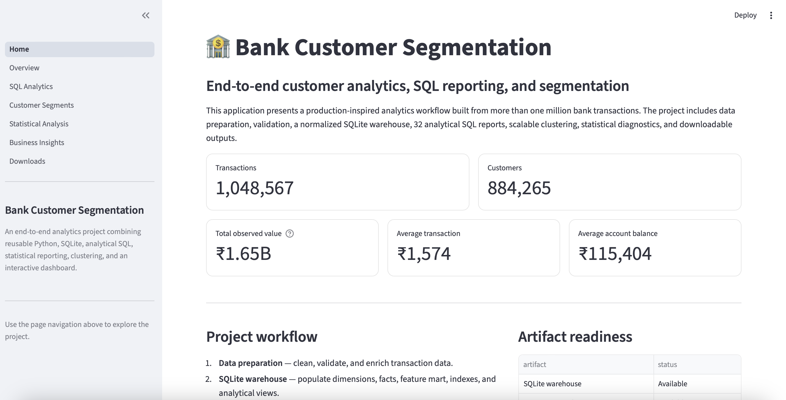
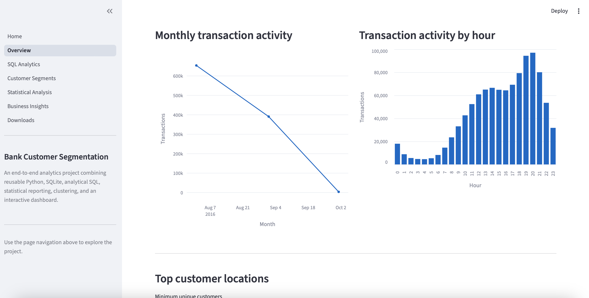
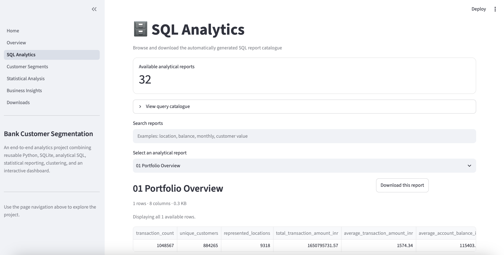
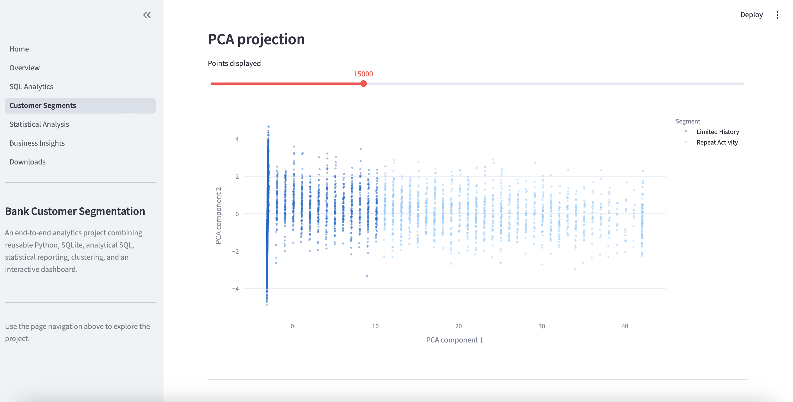
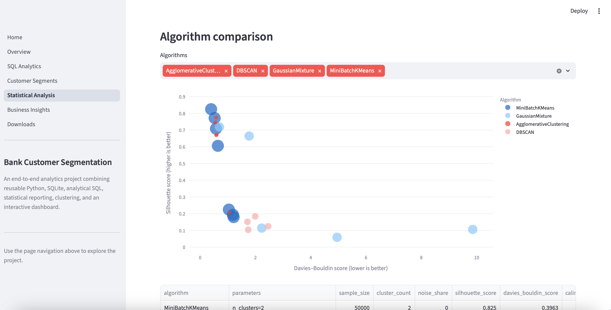
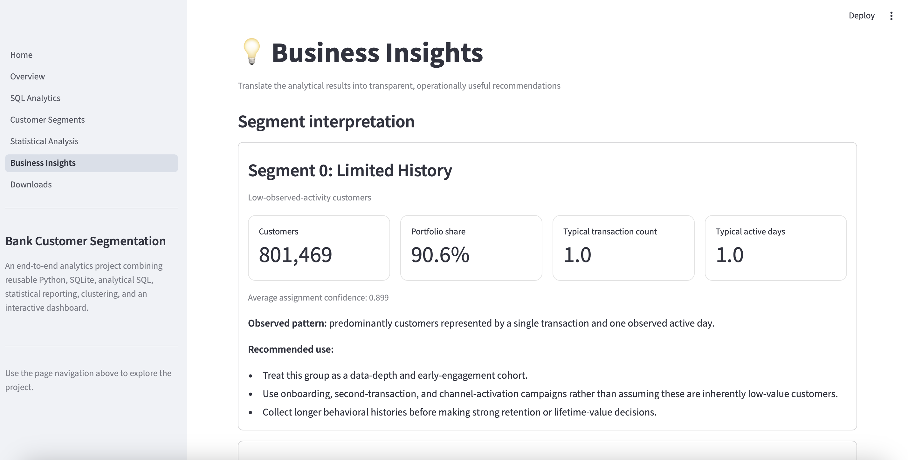
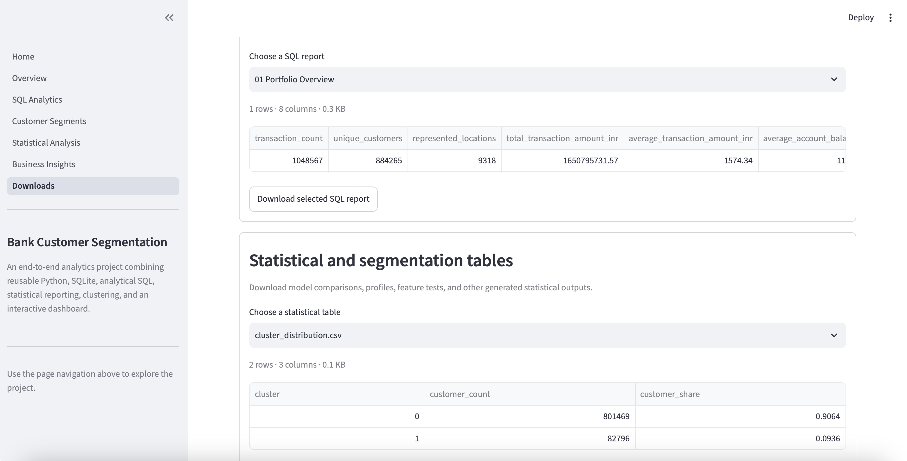

# 🏦 Bank Customer Segmentation

[](https://www.python.org/)
[](https://streamlit.io/)
[](https://www.sqlite.org/)
[](https://pytest.org/)

A production-inspired, end-to-end customer analytics project combining reusable Python, data validation, feature engineering, a normalized SQLite warehouse, analytical SQL, unsupervised machine learning, statistical diagnostics, business interpretation, and a multi-page Streamlit application.

The project processes **1,048,567 bank transactions** representing **884,265 customers** across **9,318 locations**. It generates a catalogue of **32 analytical SQL reports**, compares multiple clustering approaches, selects a scalable customer-segmentation solution, and delivers the results through an interactive dashboard with downloadable outputs.

> This repository is designed as a professional portfolio project for Data Analyst, Analytics Engineer, and Junior Data Scientist roles. It is intentionally structured as a maintainable analytics system rather than a single notebook.

---

## Dashboard

### Home



### Overview



### SQL Analytics



### Customer Segments



### Statistical Analysis



### Business Insights



### Downloads



---

## Project Objectives

The project was built to answer five related questions:

1. **How can a large transactional dataset be prepared and validated reproducibly?**
2. **How can the cleaned data be organized into an analytics-ready SQLite warehouse?**
3. **What descriptive and business-oriented insights can be produced through analytical SQL?**
4. **Can customers be grouped into statistically distinguishable activity-based segments?**
5. **How can the results be presented responsibly to technical and non-technical stakeholders?**

The resulting workflow covers the full path from raw data to reusable analytical products.

---

## Key Results

### Portfolio scale

| Metric | Result |
|---|---:|
| Transactions | 1,048,567 |
| Customers | 884,265 |
| Represented locations | 9,318 |
| Total observed transaction value | approximately ₹1.65 billion |
| Analytical SQL reports | 32 |

### Selected segmentation solution

| Metric | Result |
|---|---:|
| Algorithm | MiniBatch K-Means |
| Selected clusters | 2 |
| Silhouette score | 0.825 |
| Davies–Bouldin score | 0.396 |
| Calinski–Harabasz score | 182,847 |
| PCA variance explained by PC1 | 93.8% |

### Final customer segments

| Segment | Customers | Portfolio share | Interpretation |
|---|---:|---:|---|
| Limited History | 801,469 | 90.6% | Customers represented primarily by one observed transaction and one active day |
| Repeat Activity | 82,796 | 9.4% | Customers with more repeat activity, longer observed histories, and greater behavioral variability |

The segment names are deliberately descriptive rather than judgmental. They summarize **observed activity in this dataset** and should not be interpreted as permanent, causal, or commercially validated customer identities.

---

## Analytical Interpretation

The selected two-cluster solution is geometrically well separated according to internal clustering metrics. The split is driven primarily by:

- active days
- transaction count
- transaction amount variability
- account balance variability
- total observed transaction value

However, most customers have only one recorded transaction. The dominant segment should therefore be understood as a **limited-observation cohort**, not as a group of inherently low-value or disengaged customers.

The project explicitly distinguishes between:

- **statistical separation**
- **behavioral interpretation**
- **commercial usefulness**
- **causal validity**

Internal clustering metrics can show that groups are geometrically distinct, but they do not prove that the groups should be used directly for customer treatment, pricing, risk decisions, or long-term value assessment.

---

## Business Recommendations

### Limited History

Recommended uses include:

- onboarding and second-transaction activation campaigns
- channel-activation experiments
- collection of longer behavioral histories
- avoiding premature assumptions about customer value or engagement

### Repeat Activity

Recommended uses include:

- deeper behavioral sub-segmentation
- personalized service and engagement experiments
- value-development and retention analysis
- responsible monitoring of transaction and balance variability

### Portfolio-wide recommendations

- Recalculate the segmentation across later observation windows.
- Measure segment migration and profile stability over time.
- Link segments to retention, product adoption, profitability, and service outcomes.
- Validate commercial usefulness through controlled experiments and holdout groups.
- Treat the segmentation as a prioritization layer rather than a final customer taxonomy.

---

## End-to-End Architecture

```text
Raw transaction data
        │
        ▼
Cleaning and schema validation
        │
        ▼
Transaction-level enrichment
        │
        ▼
Customer-level feature engineering
        │
        ▼
Processed CSV outputs
        │
        ▼
Normalized SQLite warehouse
        │
        ├── dimensions
        ├── transaction fact table
        ├── customer feature mart
        ├── indexes
        └── analytical views
        │
        ▼
32 analytical SQL reports
        │
        ▼
Clustering and statistical analysis
        │
        ├── MiniBatch K-Means
        ├── Gaussian Mixture Models
        ├── Agglomerative Clustering
        ├── DBSCAN
        ├── PCA
        ├── Kruskal–Wallis tests
        ├── standardized effect ranges
        └── post-hoc assignment diagnostic
        │
        ▼
CSV, JSON, and PNG artifacts
        │
        ▼
Multi-page Streamlit dashboard
```

---

## Repository Structure

```text
Bank-Customer-Segmentation/
│
├── app/
│   ├── Home.py
│   ├── utils.py
│   ├── assets/
│   └── pages/
│       ├── 1_Overview.py
│       ├── 2_SQL_Analytics.py
│       ├── 3_Customer_Segments.py
│       ├── 4_Statistical_Analysis.py
│       ├── 5_Business_Insights.py
│       └── 6_Downloads.py
│
├── data/
│   ├── raw/
│   │   └── bank_transactions.csv
│   ├── processed/
│   ├── database/
│   └── exports/
│
├── notebooks/
│
├── reports/
│   ├── figures/
│   ├── sql/
│   └── statistical/
│
├── sql/
│   ├── create_schema.sql
│   ├── create_views.sql
│   └── analysis_queries.sql
│
├── scripts/
│   ├── prepare_data.py
│   ├── build_database.py
│   ├── run_analysis.py
│   └── run_statistical_analysis.py
│
├── src/
│   └── bank_customer_segmentation/
│       ├── __init__.py
│       ├── config.py
│       ├── data.py
│       ├── validation.py
│       ├── features.py
│       ├── database.py
│       ├── analysis.py
│       ├── clustering.py
│       ├── statistics.py
│       ├── dashboard.py
│       └── utils.py
│
├── tests/
│
├── images/
│   ├── home.png
│   ├── overview.png
│   ├── sql-analytics.png
│   ├── customer-segments.png
│   ├── statistical-analysis.png
│   ├── business-insights.png
│   └── downloads.png
│
├── .gitignore
├── pyproject.toml
├── requirements.txt
├── requirements-dev.txt
└── README.md
```

Generated databases, large processed datasets, and full customer-assignment exports are intentionally excluded from Git.

---

## Phase 1: Data Preparation

The data-preparation pipeline is implemented through reusable functions in:

```text
src/bank_customer_segmentation/data.py
src/bank_customer_segmentation/validation.py
src/bank_customer_segmentation/features.py
```

The command-line entry point is:

```text
scripts/prepare_data.py
```

The pipeline performs:

- raw CSV loading
- required-column validation
- column-name normalization
- data-type conversion
- missing-value handling
- duplicate and consistency checks
- transaction-date and transaction-time parsing
- transaction-level feature enrichment
- customer-level aggregation
- data-quality reporting
- processed-data export

The complete local run processes more than one million transactions and produces customer-level features for 884,265 customers.

---

## Phase 2: SQLite Warehouse

The database layer is implemented in:

```text
src/bank_customer_segmentation/database.py
scripts/build_database.py
```

The SQL definitions are stored in:

```text
sql/create_schema.sql
sql/create_views.sql
```

The warehouse contains normalized dimensions and analytical structures, including:

- location dimension
- customer dimension
- transaction fact table
- customer feature mart
- analytical views
- indexes supporting common report queries

The database is generated automatically from the processed outputs. The resulting SQLite file is a local artifact and is not committed because of its size.

---

## Phase 3: Analytical SQL

The SQL catalogue is stored in:

```text
sql/analysis_queries.sql
```

The execution pipeline is:

```text
src/bank_customer_segmentation/analysis.py
scripts/run_analysis.py
```

The pipeline executes all named queries and exports each result to:

```text
reports/sql/
```

The 32 reports cover areas such as:

- portfolio totals
- customer counts
- location rankings
- transaction-value distributions
- account-balance summaries
- monthly activity
- hourly activity
- customer activity depth
- demographic summaries
- high-value customer analysis
- geographic concentration
- data-quality and coverage metrics

The dashboard provides a searchable browser for the full report catalogue and supports CSV downloads.

---

## Phase 4: Customer Segmentation and Statistics

The statistical pipeline is implemented through:

```text
src/bank_customer_segmentation/clustering.py
src/bank_customer_segmentation/statistics.py
scripts/run_statistical_analysis.py
```

### Candidate algorithms

The project compares:

- MiniBatch K-Means
- Gaussian Mixture Models
- Agglomerative Clustering
- DBSCAN

MiniBatch K-Means is used for the final full-data assignment because it is computationally appropriate for hundreds of thousands of customer records.

Algorithms with higher computational cost are evaluated on bounded samples. This constraint is documented directly in the dashboard and statistical outputs.

### Internal validation metrics

Candidate solutions are assessed with:

- silhouette score
- Davies–Bouldin index
- Calinski–Harabasz index
- cluster count
- noise share where applicable
- computational sample size

### Dimensionality reduction

Principal component analysis is used to:

- visualize the customer-feature space
- inspect geometric separation
- quantify explained variance
- support interactive exploration of sampled customer points

### Feature-level diagnostics

The project includes:

- standardized cluster profiles
- random-forest feature importance for assignment distinguishability
- Kruskal–Wallis feature tests
- standardized cluster effect ranges
- assignment confidence summaries

Very small p-values underflow floating-point precision for several features. The dashboard explains that values near 307 on the `−log10(p)` scale represent numerical capping and that practical importance should be interpreted from effect sizes rather than significance alone.

### Post-hoc classifier diagnostic

A supervised model is used only to measure how reproducibly the cluster assignments can be distinguished from the engineered features.

The resulting accuracy of 1.000 does **not** provide independent predictive or external validation. It demonstrates assignment distinguishability and is reported with an explicit methodological warning.

---

## Phase 5: Streamlit Dashboard

The application is launched from:

```text
app/Home.py
```

The dashboard contains seven views.

### Home

- portfolio scale
- headline KPIs
- pipeline summary
- artifact-readiness checks
- key interpretation cards

### Overview

- monthly transaction activity
- transaction activity by hour
- interactive customer-location filtering
- location-level analytical table
- missing-data coverage summary
- filtered CSV download

### SQL Analytics

- 32-report catalogue
- report search
- report selection
- tabular preview
- report metadata
- CSV download

### Customer Segments

- segmentation KPIs
- segment distribution
- standardized segment profiles
- model-selection curve
- sampled PCA projection
- feature-importance ranking
- downloadable cluster profile

### Statistical Analysis

- selected-model summary
- multi-algorithm comparison
- model-comparison table
- Kruskal–Wallis tests
- p-value underflow explanation
- logarithmic effect-range visualization
- post-hoc assignment diagnostic
- methodological caveats

### Business Insights

- segment interpretation
- customer counts and portfolio shares
- observed behavioral patterns
- recommended uses
- cross-portfolio recommendations
- suggested measurement framework
- interpretation caveats

### Downloads

- SQL-report downloads
- statistical-table downloads
- full customer-assignment export
- generated-figure previews and downloads

---

## Testing

The project uses `pytest` to test important reusable components.

The test suite covers areas such as:

- raw-data loading
- schema validation
- feature engineering
- database construction
- database integrity
- SQL analysis helpers
- clustering and statistical utilities
- dashboard formatting and file discovery

Run the complete test suite with:

```bash
pytest
```

For a more verbose report:

```bash
pytest -v
```

---

## Installation

### 1. Clone the repository

```bash
git clone https://github.com/PontusBjorkell/Bank-Customer-Segmentation.git
cd Bank-Customer-Segmentation
```

### 2. Create a virtual environment

```bash
python -m venv .venv
```

### 3. Activate the environment

macOS or Linux:

```bash
source .venv/bin/activate
```

Windows PowerShell:

```powershell
.venv\Scripts\Activate.ps1
```

### 4. Install the project and development dependencies

```bash
python -m pip install --upgrade pip
pip install -e ".[dev]"
```

The editable installation makes the package under `src/` available to the scripts, tests, and Streamlit application.

---

## Data Setup

Place the source dataset at:

```text
data/raw/bank_transactions.csv
```

The raw dataset is not necessarily suitable for Git because of its size and licensing conditions. Users should obtain the source file separately and place it in the expected path.

---

## Running the Complete Pipeline

Run the following commands from the repository root.

### 1. Prepare and validate the data

```bash
python scripts/prepare_data.py
```

For a faster sample run:

```bash
python scripts/prepare_data.py --sample-rows 100000
```

### 2. Build the SQLite warehouse

```bash
python scripts/build_database.py
```

### 3. Execute and export the analytical SQL catalogue

```bash
python scripts/run_analysis.py
```

### 4. Run clustering and statistical analysis

```bash
python scripts/run_statistical_analysis.py
```

A faster run that skips the extended algorithm comparison may also be available:

```bash
python scripts/run_statistical_analysis.py --skip-extended-comparison
```

### 5. Run the tests

```bash
pytest
```

### 6. Launch the dashboard

```bash
streamlit run app/Home.py
```

---

## Generated Artifacts

The pipeline produces outputs in the following locations:

```text
data/processed/        cleaned transaction and customer-level datasets
data/database/         generated SQLite warehouse
data/exports/          customer segment assignments and delivery exports
reports/sql/           exported SQL report CSV files
reports/statistical/   clustering and statistical CSV/JSON outputs
reports/figures/       generated PNG figures
```

Important large artifacts include:

- the complete cleaned transaction dataset
- the customer feature dataset
- the SQLite database
- the complete customer-segment assignment file

These are generated locally and excluded from version control.

---

## Repository Hygiene

The `.gitignore` should exclude at least:

```text
.venv/
__pycache__/
.pytest_cache/
*.pyc
*.sqlite
data/raw/*.csv
data/processed/*
data/database/*
data/exports/customer_segment_assignments.csv
```

Small report outputs and screenshots may be committed when they help document the project, but large generated datasets and databases should remain local.

---

## Technology Stack

### Data and analysis

- Python
- pandas
- NumPy
- SciPy
- scikit-learn

### Database and SQL

- SQLite
- Python `sqlite3`
- normalized dimensional and fact structures
- analytical views and indexed queries

### Visualization and delivery

- Streamlit
- Plotly
- Matplotlib
- interactive tables and CSV downloads

### Engineering and quality

- modular `src/` package
- reusable command-line scripts
- pytest
- editable package installation
- `pyproject.toml`
- Git and GitHub

---

## Skills Demonstrated

This project demonstrates practical ability in:

- cleaning and validating large datasets
- designing reusable Python modules
- engineering customer-level behavioral features
- building a normalized analytics warehouse
- writing and automating analytical SQL
- selecting scalable unsupervised-learning methods
- comparing clustering algorithms
- using statistical tests and effect sizes responsibly
- developing multi-page Streamlit applications
- translating technical results into business recommendations
- documenting limitations and assumptions
- testing analytics code
- managing large local artifacts safely with Git

---

## Limitations

The results should be interpreted with several important limitations:

1. Most customers have only one observed transaction.
2. The dataset appears to cover a limited observation window.
3. Activity-based clusters do not automatically represent stable customer identities.
4. Internal clustering metrics measure geometric separation, not commercial value.
5. Gaussian mixture, hierarchical, and density-based methods are evaluated on bounded samples for computational feasibility.
6. The post-hoc classifier measures assignment distinguishability, not external predictive validity.
7. Business deployment would require temporal stability testing and linkage to measurable outcomes.

---

## Future Work

Potential extensions include:

- rolling-window segmentation
- cluster migration analysis
- segment-stability monitoring
- customer lifetime value modeling
- churn or inactivity prediction
- product-adoption modeling
- anomaly and fraud-oriented behavioral analysis
- experiment tracking
- automated pipeline orchestration
- GitHub Actions continuous integration
- Docker packaging
- cloud database integration
- public Streamlit deployment

---

## Author

**Pontus Björkell**

This project is part of a professional data analytics and data science portfolio focused on reproducible, end-to-end analytical systems.

---

## License

This repository is intended for educational and portfolio purposes.
